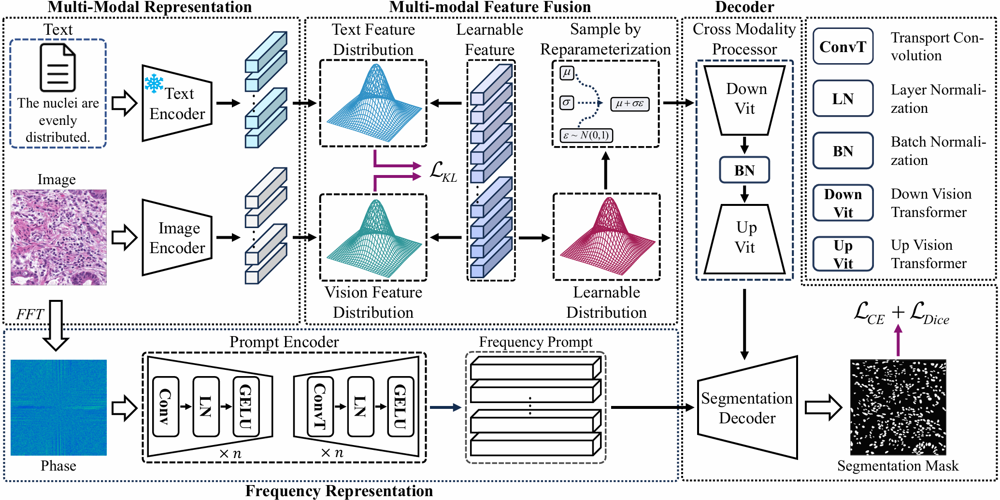

# [IJCAI 2024] Multimodal Representation Distribution Learning for Medical Image Segmentation

This repo is the official implementation of 'Multimodal Representation Distribution Learning for Medical Image Segmentation' which is accepted at IJCAI 2024.

